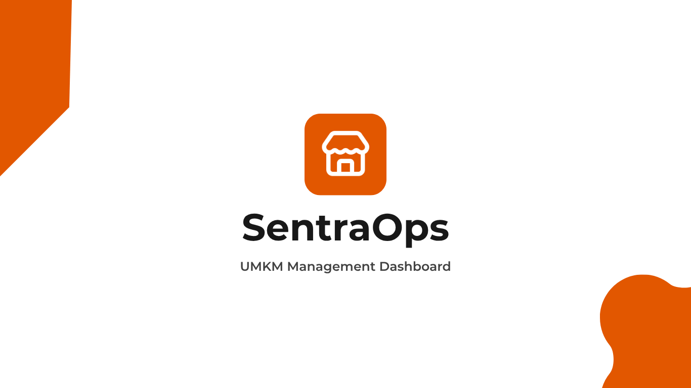

<p align="center">
  
</p>

<p align="center">
  <strong>All-in-One Operations Dashboard untuk UMKM</strong>
  <br />
  Mobile-first · Offline-ready · Multi-tenant · Open Source
  <br />
  <br />
  
  
  
  
  
  
</p>

<p align="center">
  SentraOps adalah aplikasi dashboard operasional all-in-one yang dirancang khusus untuk UMKM di Indonesia. Mulai dari Point of Sale (POS), manajemen inventaris, laporan keuangan, hingga faktur dan pengeluaran — semua terintegrasi dalam satu platform mobile-first dengan dukungan offline dan real-time sync. Open source, gratis, dan dapat dijalankan di infrastruktur sendiri.
</p>

---

## ✨ Features

| Area | Fitur |
|------|-------|
| 🔐 **Auth** | Email/password login, signup, forgot/reset password, role-based access (owner/staff) |
| 🛒 **POS** | Product grid, barcode scanner, category filter, payment drawer (cash, QRIS, debit/credit), invoice/piutang |
| 📦 **Inventory** | CRUD produk, stock adjustments, stock alerts (badge), barcode/SKU search |
| 💰 **Financial** | P&L report, payment method breakdown, top profit contributors, period selector, PDF export |
| 📄 **Invoices** | Buat faktur, edit, mark paid, overdue tracking, WhatsApp reminder |
| 📊 **Transactions** | Riwayat transaksi lengkap, bulk delete, status filter |
| 💸 **Expenses** | Catat pengeluaran per kategori (operational, restock, utility, dll) |
| 👥 **Staff** | Manajemen staf (tambah, edit, hapus) — owner only |
| ⚙️ **Settings** | Pengaturan toko (nama, alamat, telepon) |
| 📱 **PWA** | Installable, offline-capable dengan IndexedDB + service worker |
| 📡 **Offline** | Dexie.js cache, offline transaction queue, auto-sync saat online |
| 🔄 **Real-time** | Supabase Realtime untuk sinkronisasi produk |
| 🎨 **Theme** | Light/dark mode dengan design token konsisten |
| 🔒 **Security** | RLS per `store_id`, CSRF protection, rate limiting, input sanitasi |

## 🛠️ Tech Stack

| Layer | Technology |
|-------|-----------|
| **Framework** | Next.js 16 (App Router) |
| **Language** | TypeScript (Strict mode) |
| **Styling** | Tailwind CSS v4 |
| **UI Library** | shadcn/ui + Radix UI |
| **State** | Zustand (client state) |
| **Backend** | Supabase (PostgreSQL + Auth + Realtime) |
| **Offline DB** | Dexie.js (IndexedDB wrapper) |
| **Icons** | Lucide React + Material Symbols |
| **Theme** | next-themes (class strategy) |
| **Forms** | react-hook-form + zod |
| **Toasts** | sonner |
| **Testing** | Vitest (unit/integration) + Playwright (E2E) |

## 🚀 Quick Start

### Prerequisites

- Node.js 20+
- npm / yarn / pnpm
- Supabase project (free tier)

### Installation

```bash
git clone https://github.com/your-username/sentraops.git
cd sentraops
npm install
```

Buat file `.env.local`:

```env
NEXT_PUBLIC_SUPABASE_URL=https://your-project.supabase.co
NEXT_PUBLIC_SUPABASE_ANON_KEY=your-anon-key
```

Jalankan:

```bash
npm run dev
```

Buka [http://localhost:3000](http://localhost:3000).

## 💳 Payment Gateway (Xendit)

Secara opsional, SentraOps dapat terintegrasi dengan **Xendit** untuk menerima pembayaran digital (QRIS, Virtual Account, Credit Card) secara otomatis.

### Setup Xendit

1. **Daftar akun Xendit** di [https://dashboard.xendit.co](https://dashboard.xendit.co) (Development mode gratis untuk testing).
2. **Buat API Key:**
   - Dashboard Xendit → **Settings** → **API Keys** → **Generate Secret Key**
   - Salin **Development Secret Key** (mulai dengan `xnd_development_...`)
3. **Buat Webhook Verification Token:**
   - Dashboard Xendit → **Settings** → **Webhooks** → **Verification Token**
   - Generate atau salin token yang ada
4. **Setup Webhook URL:**
   - Dashboard Xendit → **Settings** → **Webhooks**
   - Tambah webhook untuk event **`Invoice Paid`** dengan URL:
     ```
     https://domain-anda.com/api/webhooks/payment
     ```
     > **Catatan:** Saat development dengan `ngrok`, kamu bisa expose localhost: `ngrok http 3000` lalu gunakan URL ngrok sebagai base webhook.

### Environment Variables

Tambahkan ke file `.env.local`:

```env
XENDIT_SECRET_KEY=xnd_development_...
XENDIT_WEBHOOK_VERIFICATION_TOKEN=token_dari_xendit
```

> **Development:** Kedua variabel ini sudah otomatis tersedia di `.env.local` proyek ini untuk development (dengan kunci development Xendit). Untuk production, ganti dengan **Production Secret Key** dari dashboard Xendit.

### Cara Kerja

| Skenario | Alur |
|----------|------|
| **QRIS** | POS → checkout → generate QRIS via Xendit QR Code API → tampilkan QR → customer scan → bayar |
| **Invoice (VA/Kartu)** | POS → checkout → buat invoice Xendit → redirect ke halaman pembayaran Xendit → customer bayar |
| **Webhook** | Xendit kirim notifikasi `Invoice Paid` ke `/api/webhooks/payment` → update status transaksi |
| **Pengingat Faktur** | Buat faktur → kirim WA reminder → Xendit buat link pembayaran → customer bayar langsung |

### Fitur Tersedia

- ✅ **QRIS** — Pembayaran QR statis/dinamis via Xendit QR Code API
- ✅ **Virtual Account** — BCA, Mandiri, BRI, dan lainnya (via Xendit Invoice)
- ✅ **Credit/Debit Card** — Via Xendit Invoice
- ✅ **Invoice Link** — Link pembayaran untuk dibagikan ke pelanggan
- ✅ **Webhook** — Update status otomatis saat pembayaran masuk
- ✅ **Xendit Dashboard** — Semua transaksi tercatat otomatis di dashboard Xendit

## 📦 Scripts

| Command | Description |
|---------|-------------|
| `npm run dev` | Start dev server (localhost:3000) |
| `npm run build` | Production build + TypeScript check |
| `npm start` | Start production server |
| `npm run lint` | ESLint |
| `npm run test` | Vitest watch mode |
| `npm run test:run` | Vitest single run (CI) |
| `npm run test:e2e` | Playwright E2E headless |
| `npm run test:e2e:ui` | Playwright E2E with UI mode |
| `npm run db:types` | Regenerate Supabase TypeScript types |
| `npm run db:push` | Push migrations to remote |
| `npm run db:pull` | Pull schema from remote |
| `npm run db:migration` | Create new migration file |

## 🏗️ Project Structure

```
src/
├── app/
│   ├── (auth)/
│   │   ├── login/               # Halaman login
│   │   ├── signup/              # Halaman registrasi
│   │   ├── forgot-password/     # Lupa password
│   │   └── reset-password/      # Reset password
│   ├── (dashboard)/             # Layout sidebar + topbar
│   │   ├── page.tsx             # Dashboard utama
│   │   ├── pos/                 # Point of Sale
│   │   ├── inventory/           # Manajemen produk (owner)
│   │   ├── financial/           # Laporan keuangan (owner)
│   │   ├── transactions/        # Riwayat transaksi
│   │   ├── expenses/            # Pengeluaran (owner)
│   │   ├── invoices/            # Faktur/piutang
│   │   ├── staff/               # Manajemen staf (owner)
│   │   └── settings/            # Pengaturan toko (owner)
│   ├── api/                     # API routes
│   ├── auth/callback/           # Supabase auth callback
│   └── access-denied/           # Halaman akses ditolak
├── components/
│   ├── ui/                      # shadcn/ui primitives (30+ komponen)
│   ├── auth/                    # LoginForm, SignupForm, RequireOwner, dll
│   ├── dashboard/               # StatCard, GlobalSearch, NotificationBell, dll
│   ├── pos/                     # ProductGrid, Cart, PaymentDrawer, dll
│   ├── inventory/               # ProductTable, ProductForm, StockBadge, dll
│   ├── financial/               # RevenueChart, PaymentMethodBreakdown, dll
│   ├── transactions/            # TransactionTable
│   ├── invoices/                # InvoicesView, EditInvoiceDialog, dll
│   ├── expenses/                # ExpensesView
│   ├── staff/                   # StaffTable, AddStaffDialog, dll
│   └── receipt/                 # ReceiptActions
├── lib/
│   ├── stores/                  # Zustand (cartStore, uiStore, dll)
│   ├── supabase/                # client.ts, server.ts, queries.ts
│   ├── types/                   # Shared types + auto-generated database.ts
│   ├── utils.ts                 # cn(), formatCurrency(), helpers
│   ├── sanitize.ts              # Input sanitization (6 functions)
│   ├── csrf.ts                  # CSRF protection
│   ├── rateLimit.ts             # Rate limiting
│   ├── fetchWithRetry.ts        # Network retry dengan exponential backoff
│   ├── inventory.ts             # Inventory utility functions
│   ├── financial-utils.ts       # Financial calculations
│   └── offlineDb.ts             # Dexie.js IndexedDB schema
├── test/                        # 109 tests (16 files)
│   ├── factories.ts             # Test data factories
│   ├── setup.ts                 # Vitest setup (mock Supabase)
│   ├── validation.test.ts       # Property-based validation tests
│   ├── error-messages.test.ts   # Property-based error message tests
│   ├── fk-integrity.test.ts     # Property-based FK integrity tests
│   ├── api-integration.test.ts  # API integration tests
│   ├── db-integration.test.ts   # Database integration tests
│   └── ...                      # Unit tests per feature
e2e/
├── login.spec.ts                # E2E login flow
└── performance.spec.ts          # Performance budget tests
```

## 🔄 Sync Architecture

```
┌──────────────────────────────────────────────────┐
│                  Online Mode                      │
│  ┌──────────┐    ┌──────────────┐                 │
│  │ Supabase │◄──►│  Realtime    │  (silent sync)  │
│  │  Server  │    │  Provider    │                  │
│  └────┬─────┘    └──────┬───────┘                 │
│       │                 │                         │
│  ┌────▼─────┐    ┌──────▼───────┐                 │
│  │  Dexie   │◄───│ Product Grid │                 │
│  │ IndexedDB│    │  + Cart      │                 │
│  └──────────┘    └──────────────┘                 │
│                                                   │
│  ┌──────────────────┐                             │
│  │ Offline Queue    │──── online event ──────────►│
│  │ (PENDING_SYNC)   │    POST /api/checkout       │
│  └──────────────────┘                             │
└──────────────────────────────────────────────────┘

         ┌ ─ ─ ─ ─ ─ ─ ─ ─ ─ ─ ┐
         │    Offline Mode        │
         │  ┌──────────────────┐  │
         │  │  Read from Dexie  │  │
         │  │  Queue to Dexie   │  │
         │  └──────────────────┘  │
         └ ─ ─ ─ ─ ─ ─ ─ ─ ─ ─ ┘
```

## ✅ Development Status — v1.1.4

### Core Platform
- [x] Project setup & Supabase integration
- [x] Authentication & role-based routing
- [x] Database schema, migrations, RLS policies
- [x] TypeScript types & strict mode
- [x] Theme system (light/dark)
- [x] Mobile-first responsive layout
- [x] Sidebar + bottom navigation
- [x] Navigation progress bar + prefetching
- [x] PWA support (manifest, service worker, iOS meta tags)

### Features
- [x] POS system (product grid, cart, barcode scanner, category filter)
- [x] Checkout flow (cash, QRIS, debit/credit, invoice/piutang)
- [x] Inventory management (CRUD, stock updates, stock badges)
- [x] Financial page (P&L, payment breakdown, top products, PDF export)
- [x] Transaction history with bulk delete
- [x] Invoice management (create, edit, mark paid, WA reminder)
- [x] Expense tracking per kategori
- [x] Staff management (CRUD)
- [x] Store settings
- [x] Pagination (POS 25, inventory 30, invoices 10, transactions 15)

### Offline & Real-time
- [x] Offline mode (Dexie.js cache, offline transaction queue)
- [x] Real-time sync (Supabase Realtime for products)
- [x] Offline queue auto-sync on `online` event

### Security
- [x] Input sanitization (6 functions)
- [x] CSRF protection (token-based)
- [x] Rate limiting (in-memory sliding window)
- [x] Network retry (exponential backoff)
- [x] RLS policies on all tables
- [x] Server-side role verification

### Testing
- [x] Test data factories (9 factories)
- [x] Unit tests (stores, utils, checkout logic)
- [x] Property-based tests (validation, error messages, FK integrity)
- [x] API integration tests (5 test suites)
- [x] Database integration tests (15 test suites)
- [x] E2E tests (login flow, performance budget)
- [x] Build zero errors

## 📖 Documentation

Dokumentasi lengkap tersedia di folder [`doc/`](./doc):

| File | Isi |
|------|-----|
| [01-ARSITEKTUR.md](doc/01-ARSITEKTUR.md) | Tech stack, folder structure, routing |
| [02-DATABASE.md](doc/02-DATABASE.md) | Tabel, relasi, RLS, migrasi |
| [03-AUTH.md](doc/03-AUTH.md) | Alur auth, proxy, role-based access |
| [04-API.md](doc/04-API.md) | Endpoint API route |
| [05-KOMPONEN.md](doc/05-KOMPONEN.md) | UI component library, design system |
| [06-STATE.md](doc/06-STATE.md) | Zustand stores |
| [07-SECURITY.md](doc/07-SECURITY.md) | Sanitasi, rate limit, CSRF |
| [08-TESTING.md](doc/08-TESTING.md) | Unit test, property test, E2E |
| [09-PERFORMANCE.md](doc/09-PERFORMANCE.md) | SSR, lazy loading, optimasi |
| [10-DEPLOYMENT.md](doc/10-DEPLOYMENT.md) | Environment, build, hosting |

Juga lihat: [AGENTS.md](./AGENTS.md) — Development conventions.

## 🤝 Contributing

SentraOps adalah proyek open source. Siapa pun dipersilakan untuk **fork, clone, dan memodifikasi**.

1. Fork repository
2. Buat branch fitur: `git checkout -b fitur-keren`
3. Ikuti konvensi di `AGENTS.md`
4. Pastikan `npm run build` tidak error
5. Jalankan `npm run test:run` untuk verifikasi tes
6. Push: `git push origin fitur-keren`
7. Buat Pull Request

## 📄 License

[MIT](./LICENSE) © SentraOps

---

<p align="center">
  Dibangun untuk UMKM Indonesia.
  <br />
  Open source · Bebas dimodifikasi · Tanpa biaya lisensi
</p>
